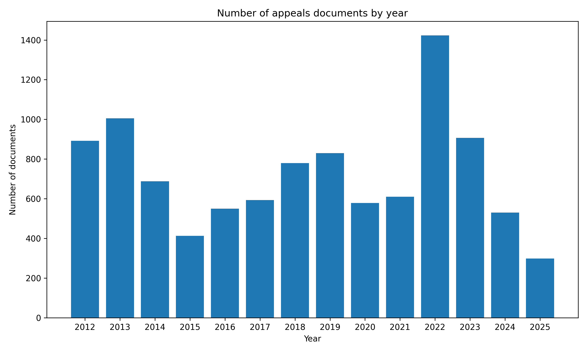

# Appeals

## Data Summary

|   |    |
| :-- | --: |
| Data Source | https://courtofappeal.lk |
| Date Range | 2012-04-23 to 2025-09-11 |
| Number of Docs | 9,416 |
| Number of Docs with PDFs | 7,835 |
| Dataset Size | 8.0GB |

## Document Metadata Example

```json
{
    "num": "CA/WRT/0475/2019",
    "date_str": "2025-09-11",
    "description": "Mudaliperuge Manel Rupa Ranjani Kulathunga Vs M. U. Nishantha, Divisional Secretary, Galewela and ten others before Hon. K.M.G.H. Kulatunga, J.",
    "url_pdf": "https://courtofappeal.lk/?melsta_doc_download=1&doc_id=28f6df4f-d61e-469a-a1b8-a65c7e840138&filename=WRT-0475-19%20-%2010.09.2025.pdf.pdf",
    "url_metadata": "https://courtofappeal.lk/?page_id=13121",
    "parties": "Mudaliperuge Manel Rupa Ranjani Kulathunga Vs M. U. Nishantha, Divisional Secretary, Galewela and ten others",
    "judgement_by": "Hon. K.M.G.H. Kulatunga, J.",
    "keywords": "Land Development Ordinance (LDO) permit \u2022 succession \u2022 legitimate expectation (procedural & substantive) \u2022 cancellation of permits \u2022 laches \u2022 occupation",
    "legistation": "Article 140 of the Constitution of Sri Lanka \u2022 Land Development Ordinance (LDO)"
}
```

[source data](https://github.com/nuuuwan/lk_judiciary_appeals_court/tree/data/data/appeals/2020s/2025/2025-09-11-CA-WRT-0475-2019)

## Documents By Year



## 🤗 Hugging Face Datasets

- [nuuuwan/lk-docs-appeals-docs](https://huggingface.co/datasets/nuuuwan/lk-docs-appeals-docs)
- [nuuuwan/lk-docs-appeals-chunks](https://huggingface.co/datasets/nuuuwan/lk-docs-appeals-chunks)

## 20 Latest documents

- 2025-09-11 | `CA/WRT/0475/2019` | Mudaliperuge Manel Rupa Ranjani Kulathunga Vs M. U. Nishantha, Divisional Secretary, Galewela and ten others before Hon. K.M.G.H. Kulatunga, J. | [data](https://github.com/nuuuwan/lk_judiciary_appeals_court/tree/data/data/appeals/2020s/2025/2025-09-11-CA-WRT-0475-2019)
- 2025-09-10 | `CA/WRT/811/2025` | A. A. F. Farween Vs The Secretary of the Judicial Service Commission and Hon. Attorney General before Hon. Dr. D. F. H. Gunawardhana, J. | [data](https://github.com/nuuuwan/lk_judiciary_appeals_court/tree/data/data/appeals/2020s/2025/2025-09-10-CA-WRT-811-2025)
- 2025-09-10 | `CA /HCC/ 292-295/2024` | Kohona Koralalage Chandraratna Bandara and others Vs Hon. Attorney General before Hon. B. Sasi Mahendran, J. | [data](https://github.com/nuuuwan/lk_judiciary_appeals_court/tree/data/data/appeals/2020s/2025/2025-09-10-CA--HCC--292-295-2024)
- 2025-09-09 | `CA/WRT/165/15` | Mrs. Nagaratnam Sakunthala Vs Commissioner of Lands (Northern Province) Department of Land Administration, Northern Provincial Council and others before Hon. Dhammika Ganepola, J. | [data](https://github.com/nuuuwan/lk_judiciary_appeals_court/tree/data/data/appeals/2020s/2025/2025-09-09-CA-WRT-165-15)
- 2025-09-09 | `CA/WRT/0720/23` | Musthafa Lebbe Rahuma Beevi Vs. Thanapalasuntharam, Divisional Secretary, Valachennai and eight others before Hon. K.M.G.H. Kulatunga, J. | [data](https://github.com/nuuuwan/lk_judiciary_appeals_court/tree/data/data/appeals/2020s/2025/2025-09-09-CA-WRT-0720-23)
- 2025-09-09 | `CA/HCC/ 0079/2020` | Alankarage Dilan Prasanga alias Kannadiya Vs The Hon. Attorney General before Hon. P. Kumararatnam, J. | [data](https://github.com/nuuuwan/lk_judiciary_appeals_court/tree/data/data/appeals/2020s/2025/2025-09-09-CA-HCC--0079-2020)
- 2025-09-09 | `CA /Writ/208/2019` | Bibile Kotagama Multipurpose Cooperative Society Limited Vs K. M. G. Kapila Bandara (Former) Divisional Secretary, Divisional Secretariat Office, Madagama. and others before Hon. Dhammika Ganepola, J. | [data](https://github.com/nuuuwan/lk_judiciary_appeals_court/tree/data/data/appeals/2020s/2025/2025-09-09-CA--Writ-208-2019)
- 2025-09-09 | `CA/ PHC/ 148/ 2018` | Kehelpannala Ralalage Upali Mahinda Kempitiya and Another Vs Korale Gedara Upali Kumara Abeyrathne before Hon. Damith Thotawatte, J. | [data](https://github.com/nuuuwan/lk_judiciary_appeals_court/tree/data/data/appeals/2020s/2025/2025-09-09-CA--PHC--148--2018)
- 2025-09-04 | `CA (HCC)0275/2023` | Balachandran Sivam Vs. Hon. Attorney Genera before Hon. R.P. Hettiarachchi, J. | [data](https://github.com/nuuuwan/lk_judiciary_appeals_court/tree/data/data/appeals/2020s/2025/2025-09-04-CA--HCC-0275-2023)
- 2025-09-03 | `CA/WRT/734/2024` | Razik Rafeekdeen Vs. The Incorporated Council of Legal Education and four others before Hon. K.M.G.H. Kulatunga, J. | [data](https://github.com/nuuuwan/lk_judiciary_appeals_court/tree/data/data/appeals/2020s/2025/2025-09-03-CA-WRT-734-2024)
- 2025-09-03 | `CA/RII/0048/2023` | Chethana Erandithavo Jayakody Vs Lanka Telephone Company (Pvt) Ltd and others before Hon. R. Gurusinghe, J. | [data](https://github.com/nuuuwan/lk_judiciary_appeals_court/tree/data/data/appeals/2020s/2025/2025-09-03-CA-RII-0048-2023)
- 2025-09-03 | `CA/HCC/ 0101/2022` | Demuni Sudath Ashoka De Zoysa Vs The Hon. Attorney General before Hon. P. Kumararatnam, J. | [data](https://github.com/nuuuwan/lk_judiciary_appeals_court/tree/data/data/appeals/2020s/2025/2025-09-03-CA-HCC--0101-2022)
- 2025-09-02 | `CA/HCC/ 0226-228/2019` | Samarakkody Arachchilage Gamini Weerasinghe alias Yakada Gamini and others Vs The Hon. Attorney General before Hon.P. Kumararatnam, J. | [data](https://github.com/nuuuwan/lk_judiciary_appeals_court/tree/data/data/appeals/2020s/2025/2025-09-02-CA-HCC--0226-228-2019)
- 2025-09-02 | `CA/ PHC/48/2016` | N.D. Vimal Vs Competent Authority, Plantation Management Monitoring Division, Ministry of Plantation Industries and another. before Hon. Damith Thotawatte, J. | [data](https://github.com/nuuuwan/lk_judiciary_appeals_court/tree/data/data/appeals/2020s/2025/2025-09-02-CA--PHC-48-2016)
- 2025-09-01 | `CA/HCC/ 0117/2024` | Abeywickrama Dissanayaka Piyadasa Vs The Hon. Attorney General before Hon. P. Kumararatnam, J. | [data](https://github.com/nuuuwan/lk_judiciary_appeals_court/tree/data/data/appeals/2020s/2025/2025-09-01-CA-HCC--0117-2024)
- 2025-08-29 | `CA/WRT/422/2023` | Rathnayaka Mudiyanselage Weerasinghe and Others Vs Hon. (Dr.) Susil Premajayantha and Others before Hon. S.U.B. Karalliyadde, J. | [data](https://github.com/nuuuwan/lk_judiciary_appeals_court/tree/data/data/appeals/2020s/2025/2025-08-29-CA-WRT-422-2023)
- 2025-08-29 | `CA-WRT-293/21` | Mohamed Alavi Navaz Caffoor and others Vs The Director Mosque and Muslim Charitable Trusts or Wakfs and others before Hon. B. Sasi Mahendran, J. | [data](https://github.com/nuuuwan/lk_judiciary_appeals_court/tree/data/data/appeals/2020s/2025/2025-08-29-CA-WRT-293-21)
- 2025-08-29 | `CA/WRT/147/2024` | The Petroleum Dealers’ Association, Lanka Filling Station, Vs Ceylon Petroleum Corporation, before Hon. Dr. Sumudu Premachandra J. | [data](https://github.com/nuuuwan/lk_judiciary_appeals_court/tree/data/data/appeals/2020s/2025/2025-08-29-CA-WRT-147-2024)
- 2025-08-29 | `CA/RII/0086/2024` | Dissanayake Mudiyanselage Darmasena Bandara, Vs Wanasinghe Mudiyanselage Jayasinghe Bandara, before Hon. Dr. Sumudu Premachandra J. | [data](https://github.com/nuuuwan/lk_judiciary_appeals_court/tree/data/data/appeals/2020s/2025/2025-08-29-CA-RII-0086-2024)
- 2025-08-29 | `CA(PHC)/0030/2020` | Raj Fernando Vs. Subramaniam Sathasiwam & 1 Other before Hon. K. M. S. DISSANAYAKE, J. | [data](https://github.com/nuuuwan/lk_judiciary_appeals_court/tree/data/data/appeals/2020s/2025/2025-08-29-CA-PHC--0030-2020)
